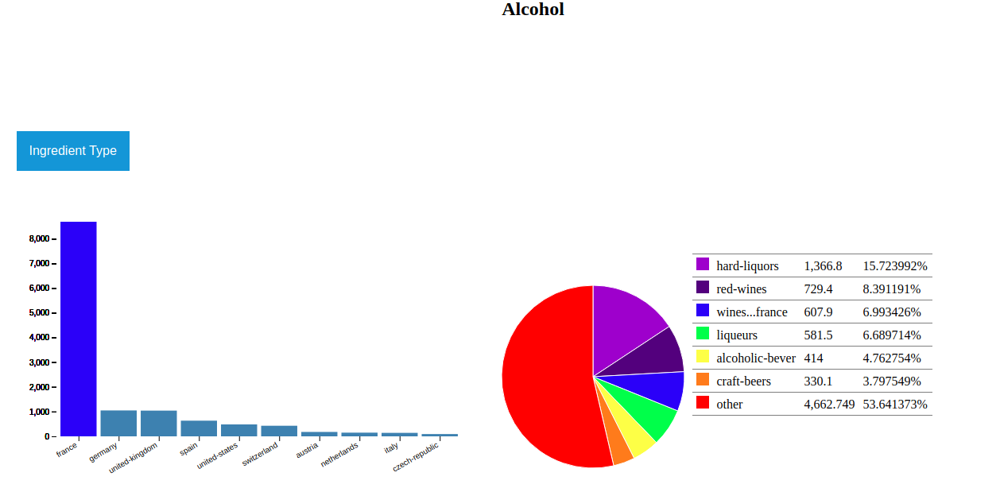

# d3_Food_facts
Visualization of the food facts dataset using d3.js

# Open Food Facts
Free and open database of food products from around the world
75 000+ products from 150 countries 

# Design Hypotheses 
1. Aim: Investigate the food consumption between countries. Do certain countries like to eat foods with more of one ingredient than others.
Limitations: We limit our analysis for the food consumption on the top 10 countries per food ingredient.
Possible Question: How does France consume foods that contain salt as compared to the other countries? What classes of foods are usually popular in this country based on a particular ingredient?

Design of Visualization

2. Aim : Understanding different alcoholic beverages available, in what categories they belong to and the region where it comes from 
Questions : 
What are the different categories of alcoholic beverages?
What are the wines that are manufactured in France?

3. Aim: Understand where are the differences between the nutrition score in France and in UK, and what categories of product are concerned. See the concerned categories would help us to understand why there is this difference. Maybe the concerned categories are culturally important for one country and not the other.
Question:
What are the categories that have a different nutrition score in France and in UK ?

Design Choices
Barplot to represent the quantity of product in each category
Only categories with more than 10 products selected
Color to symbolize the mean difference in the nutrition score
Ordered categories depending on the difference in the nutrition score associated with the color

4. Aim: 
Compare the labels where we can find the less amount of additives. Maybe vegan or organic products have less additives than standard products.
Question:
What is the label (or the labels) where there is the lowest amount of additives ?

